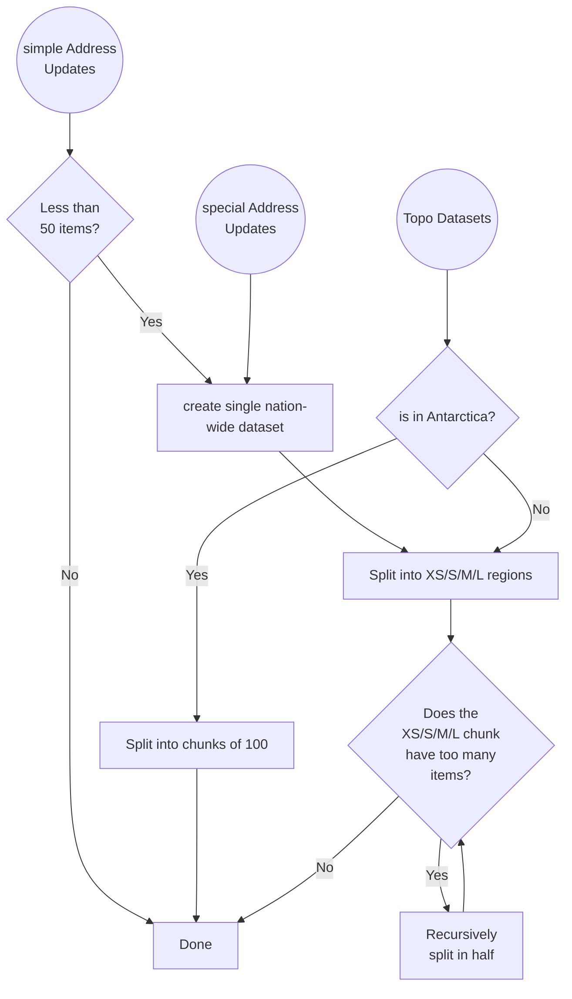

This part of the code does the following:

1. converts the conflated address data into `osmPatch` files
2. adds the `extraLayers`
3. splits the datasets into chunks
4. generates address stats
5. saves the osmPatch files and the index file.

### Logic for splitting datasets

